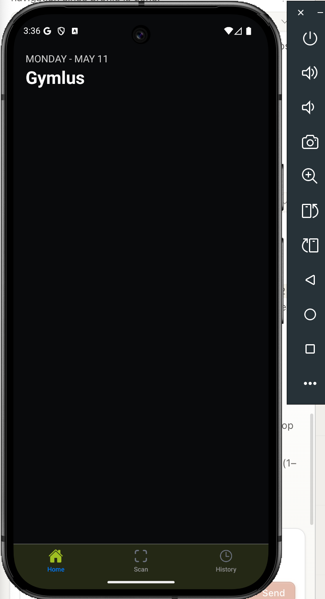
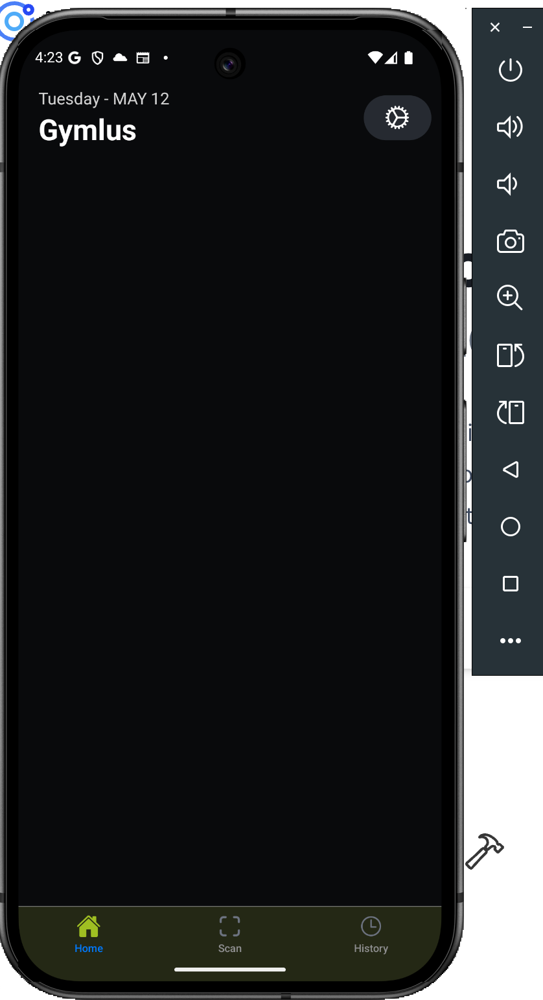
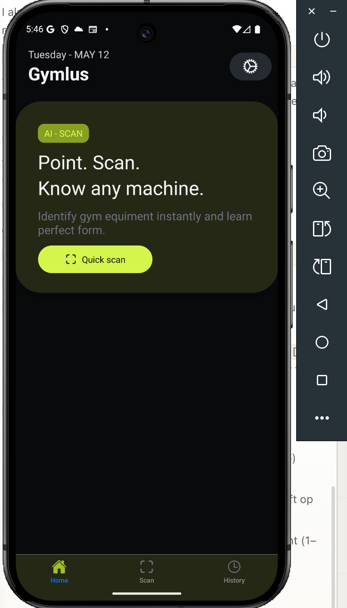
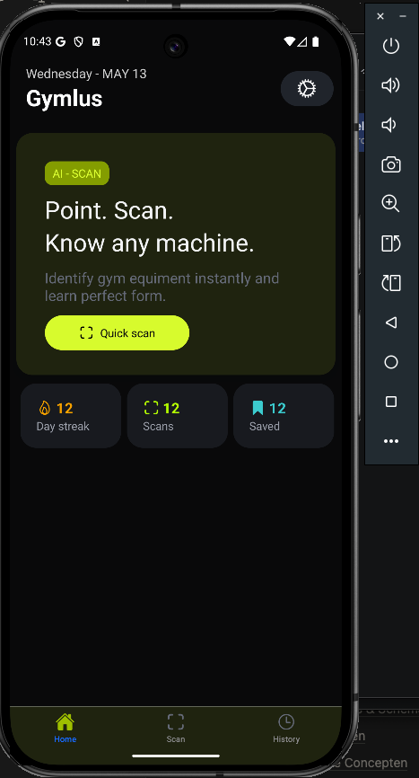
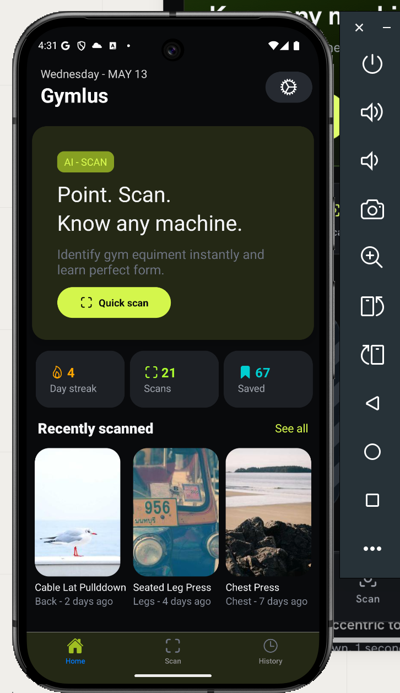
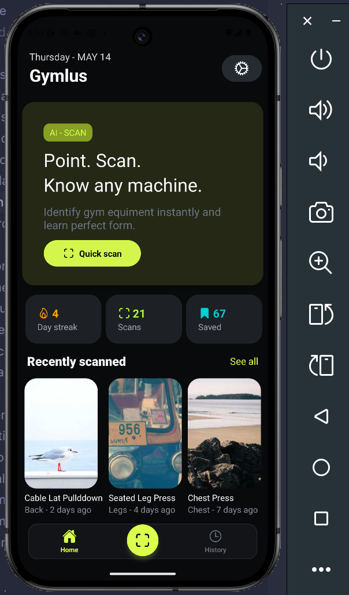
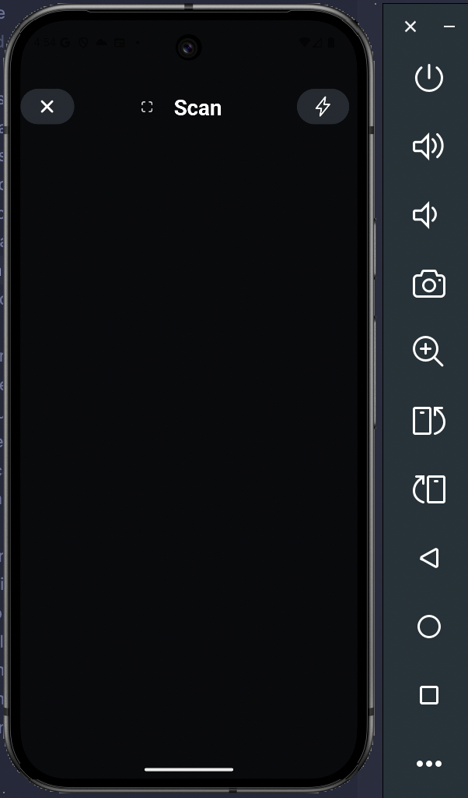
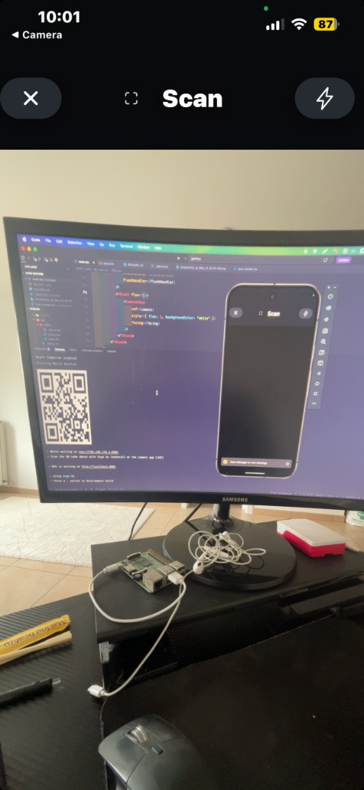
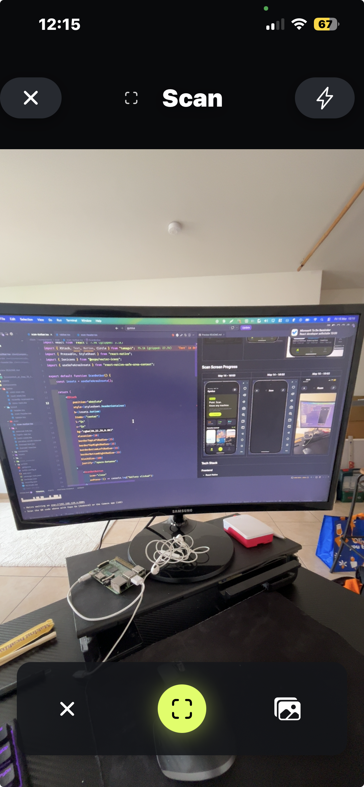

# Gymlus

Gymlus is a mobile fitness app built with React Native and FastAPI.

The app lets users scan gym machines or exercise cards using their camera. AI then recognizes the exercise and shows useful information such as:

- muscle groups
- instructions
- difficulty
- common mistakes
- exercise videos

## Home Screen Progress

| May 12 - 15:36 | May 12 - 16:23 | May 12 - 17:46 |
| :----: | :----: | :----: |
|  |  |  |

| May 13 - 10:43 | May 13 - 11:11 | May 13 - 16:32 |
| :----: | :----: | :----: |
|  |  |  |

## Scan Screen Progress

| May 14 - 16:53 | May 14 - 16:55 | May 15 - 10:02 |
| :----: | :----: | :----: |
|  |  |  |

| May 15 - 12:16 | ... | ... |
| :----: | :----: | :----: |
|  | ... | ... |

## Tech Stack

### Frontend

- React Native
- Expo
- TypeScript
- Tamagui

### Backend

- FastAPI
- Python

### Database

- PostgreSQL

## Features

- Exercise scanning
- AI exercise recognition
- Exercise details
- Workout history
- Saved exercises

## Goals

This project is focused on:

- improving React Native and TypeScript skills
- building a structured full-stack application
- learning mobile architecture and clean UI design
- integrating AI into a real product

## Status

Currently in development.
